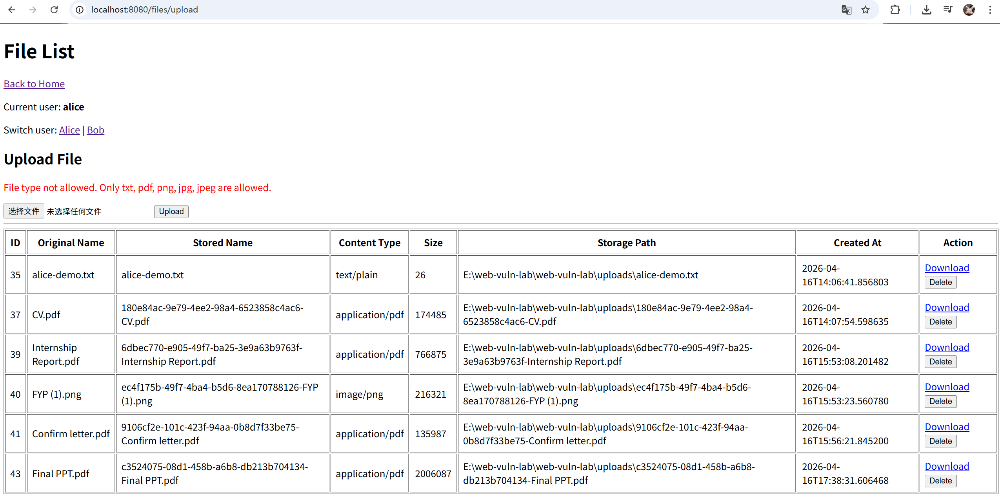
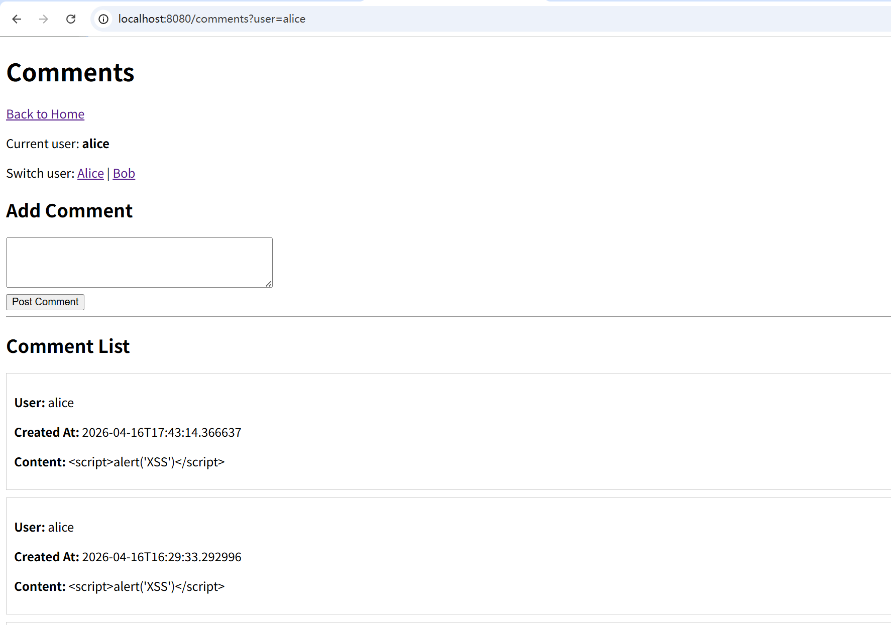
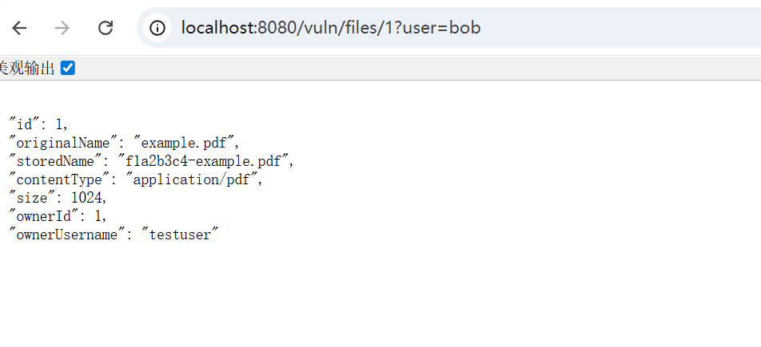
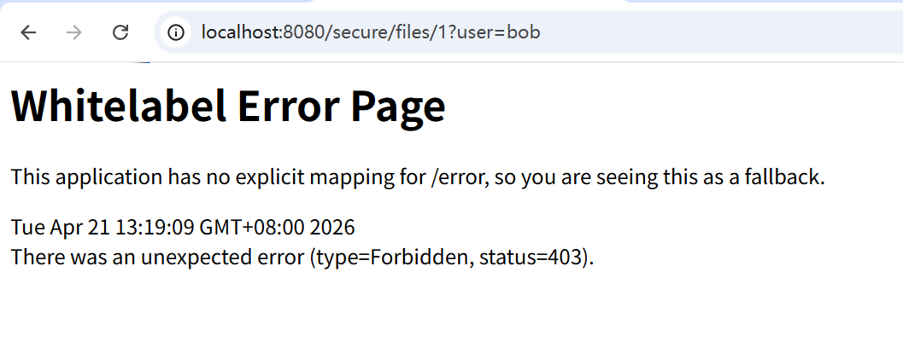
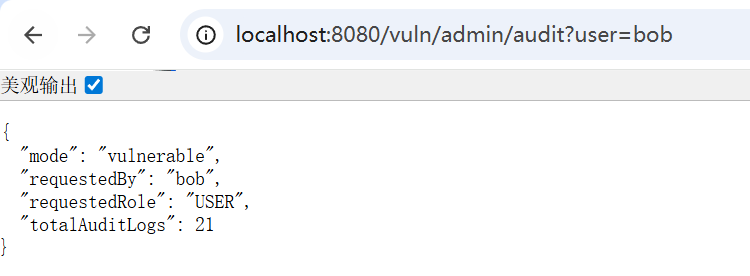
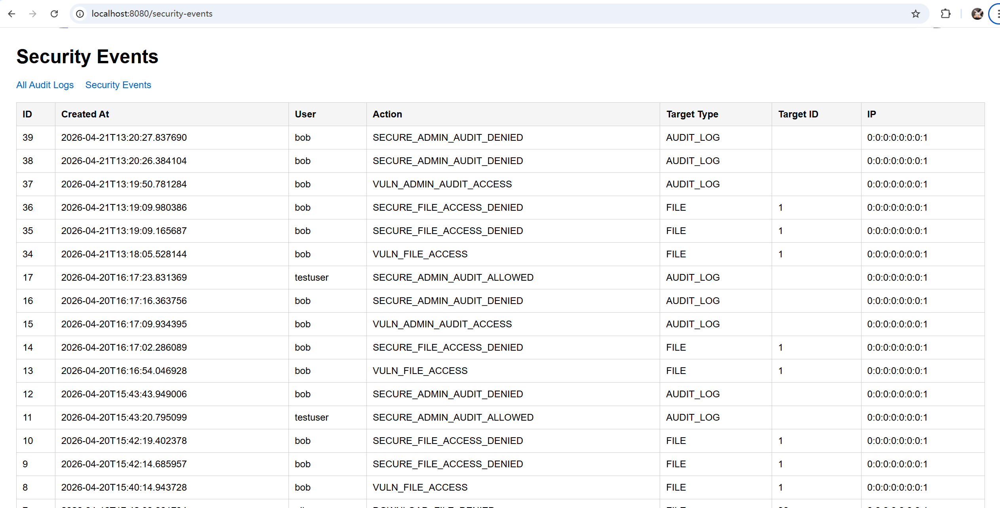
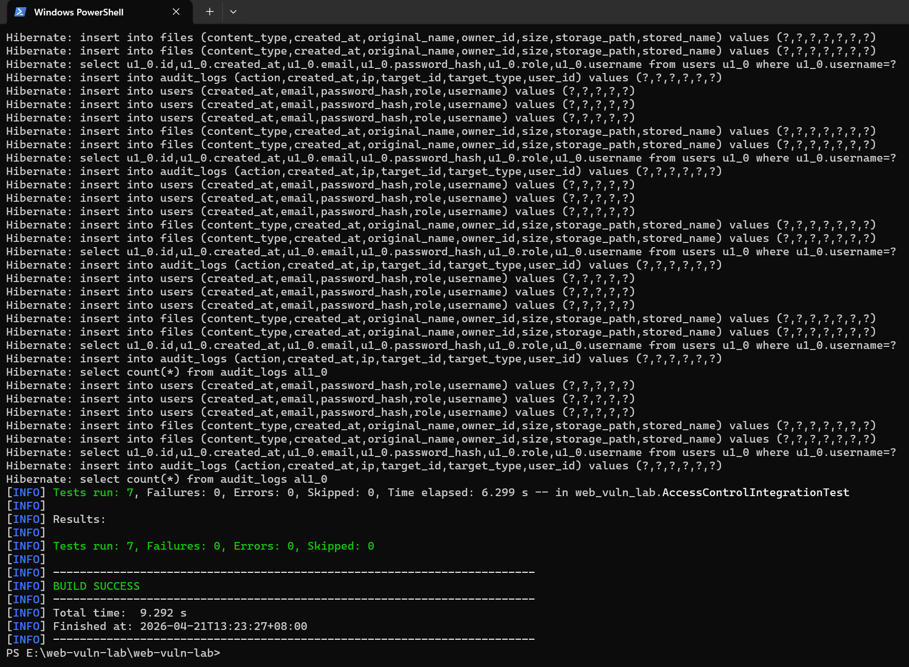

# Web Vuln Lab: Vulnerability Reproduction, Remediation, and Verification

## Overview

Web Vuln Lab is a Java-based web security practice project built with Spring Boot, Thymeleaf, and PostgreSQL.

The project demonstrates how common web application vulnerabilities can be reproduced, fixed, and verified in a controlled lab environment. It includes both vulnerable and secure implementations so that insecure behavior can be compared directly with protected behavior.

This project was extended beyond basic vulnerability demos to include access control case studies, security event logging, and automated integration testing.

## Motivation

Many educational security projects focus only on exploitation. This project goes further by showing how vulnerabilities can be reproduced, how secure fixes can be implemented, and how remediation can be verified through logging and automated testing.

The goal of this project is to present a small but structured security practice environment rather than just a collection of vulnerable pages.

## Security Objectives

The main objectives of this project are:

- reproduce realistic web security flaws
- explain the root causes of insecure behavior
- implement secure remediation strategies
- verify that fixes work correctly
- record security-relevant events for later analysis

## Tech Stack

- Java 17
- Spring Boot
- Spring Security
- Spring Data JPA
- Thymeleaf
- PostgreSQL
- Maven / Maven Wrapper
- JUnit-based integration testing

## Implemented Modules

### Existing Modules

#### 1. Broken Access Control

This case demonstrates how a user could access another user's file by manipulating the file ID.

- vulnerable behavior: file access handled only by file ID
- attack effect: unauthorized download or deletion
- fix: ownership validation before sensitive operations
- result after fix: `403 Forbidden`

#### 2. Insecure File Upload

This case demonstrates how a system can accept unexpected or unsafe file types when upload validation is weak.

- vulnerable behavior: uploaded files accepted without strict controls
- attack effect: unexpected file types stored in the system
- fix: extension allowlist and file size restriction
- result after fix: unsupported or oversized files are rejected

#### 3. Stored XSS

This case demonstrates how unescaped stored content can execute malicious script in other users' browsers.

- vulnerable behavior: comments rendered with unescaped output
- attack effect: script execution when viewing comments
- fix: escaped output rendering
- result after fix: script content is displayed as plain text

### Extended Access Control Case Study

#### 4. Horizontal Unauthorized Access (IDOR-style behavior)

This case demonstrates how a user can access another user's file by directly modifying the file ID in the request.

- vulnerable endpoint: `/vuln/files/{id}`
- secure endpoint: `/secure/files/{id}`
- vulnerable result: unauthorized access succeeds
- secure result: unauthorized access is blocked with `403 Forbidden`

#### 5. Vertical Privilege Escalation

This case demonstrates how a normal user can access admin-only functionality when role checks are missing.

- vulnerable endpoint: `/vuln/admin/audit`
- secure endpoint: `/secure/admin/audit`
- vulnerable result: non-admin access succeeds
- secure result: non-admin access is blocked with `403 Forbidden`
- admin result: authorized admin access remains allowed

### Supporting Features

- file upload and file management
- comment functionality
- audit logging
- security events page: `/security-events`
- automated integration tests for vulnerable and secure access control behavior

## Access Control Case Study

This project includes a dedicated access control case study covering both horizontal unauthorized access and vertical privilege escalation.

### Horizontal Unauthorized Access (IDOR-style behavior)

The vulnerable file endpoint allows a user to access another user's file directly by modifying the file ID in the request.

- Vulnerable endpoint: `/vuln/files/{id}`
- Secure endpoint: `/secure/files/{id}`

Expected behavior:

- vulnerable version: unauthorized access succeeds
- secure version: unauthorized access is blocked with HTTP 403

### Vertical Privilege Escalation

The vulnerable admin audit endpoint allows a normal user to access admin-related audit information.

- Vulnerable endpoint: `/vuln/admin/audit`
- Secure endpoint: `/secure/admin/audit`

Expected behavior:

- vulnerable version: non-admin access succeeds
- secure version: non-admin access is blocked with HTTP 403
- admin access remains allowed

## Security Events

The project records security-relevant actions and displays them through the Security Events page.

Example logged actions include:

- `VULN_FILE_ACCESS`
- `SECURE_FILE_ACCESS_DENIED`
- `SECURE_FILE_ACCESS_ALLOWED`
- `VULN_ADMIN_AUDIT_ACCESS`
- `SECURE_ADMIN_AUDIT_DENIED`
- `SECURE_ADMIN_AUDIT_ALLOWED`

This makes it possible to observe the difference between insecure and protected application behavior.

## Testing

The project includes integration tests to verify both vulnerable and secure behavior.

The automated tests cover:

- vulnerable file access success for unauthorized users
- secure file access denial for unauthorized users
- legitimate owner access to protected files
- vulnerable admin audit access for non-admin users
- secure admin audit denial for non-admin users
- secure admin audit access for admin users
- security event logging for allowed and denied actions

## Project Structure

- `src/main/java/web_vuln_lab/`  
  Main controllers, services, and application logic

- `src/main/java/web_vuln_lab/entity/`  
  JPA entities such as `User`, `FileRecord`, and `AuditLog`

- `src/main/java/web_vuln_lab/repository/`  
  Repository interfaces for database access

- `src/main/resources/templates/`  
  Thymeleaf templates

- `src/test/java/web_vuln_lab/`  
  Integration tests

- `docs/`  
  Project documentation and case study notes

## How to Run

1. Configure PostgreSQL and update the database settings in `application.properties`.
2. Make sure the database is running.
3. Start the application with Maven Wrapper by using Powershell:
   .\mvnw.cmd spring-boot:run
4. Open the application in the browser.
5. Use different `?user=` values to simulate different users during the access control demonstrations.

## Demo Scenarios

### File Access Control

- vulnerable access: `http://localhost:8080/vuln/files/1?user=bob`
- secure access: `http://localhost:8080/secure/files/1?user=bob`
- legitimate owner access: `http://localhost:8080/secure/files/1?user=alice`

### Admin Audit Access

- vulnerable admin access: `http://localhost:8080/vuln/admin/audit?user=bob`
- secure admin denial: `http://localhost:8080/secure/admin/audit?user=bob`
- secure admin access: `http://localhost:8080/secure/admin/audit?user=testuser`

### Security Events

- `http://localhost:8080/security-events`

## Screenshots

### 1. Project Home Page


### 2. File Upload Validation



### 3. Stored XSS Remediation



### 4. Vulnerable File Access



### 5. Secure File Access Denied



### 6. Vulnerable Admin Audit Access



### 7. Security Events Page



### 8. Integration Test Result



## Limitations

This project uses a simplified user simulation model through request parameters such as `?user=alice` and `?user=bob`.

It is designed as a controlled educational lab rather than a production-ready security platform.

The current implementation does not include:

- full session-based identity handling
- attribute-based access control
- multi-tenant authorization policies
- advanced alerting or dashboard analytics

## Disclaimer

This project is intended for educational and defensive security practice only.

It is designed to demonstrate vulnerability reproduction, secure remediation, and verification in a controlled environment. It must not be deployed as a public production system in its vulnerable form.

```

```
