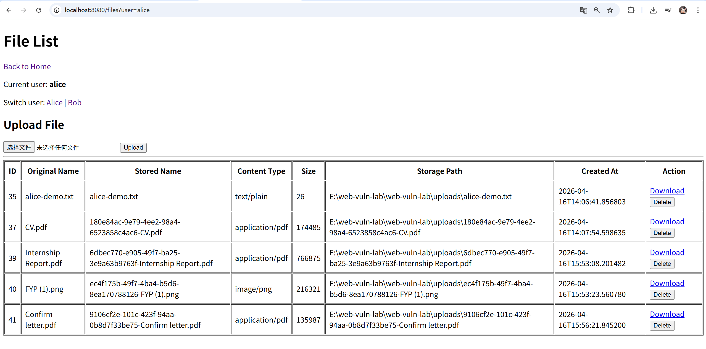
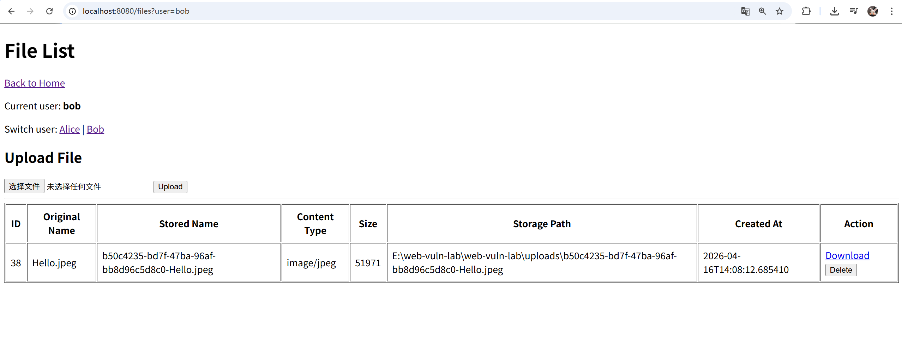
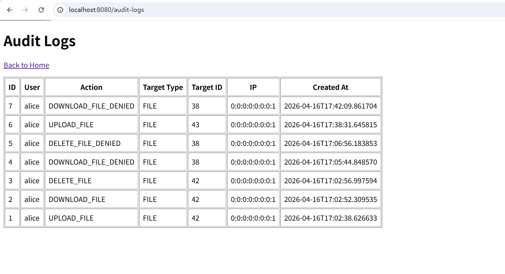

# Web Vuln Lab

A mini web security lab built with Spring Boot and PostgreSQL.

This project simulates a small cloud-file platform and demonstrates three common web security issues in a controlled local environment:

- Broken Access Control
- Insecure File Upload
- Stored XSS

The project not only shows vulnerable behavior, but also includes:

- secure remediation
- audit logging
- user-based isolation
- reproducible demo scenarios

---

## Project Highlights

This project is designed as a **security-oriented web application demo**, not just a simple file system.

It demonstrates a complete workflow for each security case:

1. implement normal functionality
2. expose a vulnerable behavior
3. demonstrate the attack scenario
4. apply a secure fix
5. verify the fix
6. record related audit logs

This makes the project suitable for:

- final year project demonstration
- GitHub portfolio
- web security learning
- academic presentation

---

## Core Features

### File Management

- upload file
- list files
- download file
- delete file

### User Simulation

- switch between `alice` and `bob` using query parameters
- user-specific file listing
- user-specific upload ownership

### Comment System

- add comments
- display stored comments
- demonstrate Stored XSS and secure rendering

### Audit Logging

- record successful file operations
- record denied unauthorized attempts
- view audit logs in a dedicated page

---

## Security Cases

### 1. Broken Access Control

This case demonstrates how a user could access another user's file by manipulating the file id.

- vulnerable behavior: file access handled only by file id
- attack effect: unauthorized download / deletion
- fix: ownership validation before sensitive operations
- result after fix: `403 Forbidden`

### 2. Insecure File Upload

This case demonstrates how a system can accept unexpected or unsafe file types when upload validation is weak.

- vulnerable behavior: uploaded files accepted without strict controls
- attack effect: unexpected file types stored in the system
- fix: extension allowlist + file size restriction
- result after fix: unsupported or oversized files are rejected

### 3. Stored XSS

This case demonstrates how unescaped stored content can execute malicious script in other users' browsers.

- vulnerable behavior: comments rendered with unescaped output
- attack effect: script execution when viewing comments
- fix: escaped output rendering
- result after fix: script content is displayed as plain text

---

## Security Workflow

Each vulnerability in this project follows the same structure:

- **vulnerable version**
- **attack demonstration**
- **secure remediation**
- **verification after remediation**
- **audit logging support**

This makes the project easier to explain during presentation and easier to evaluate from a security engineering perspective.

---

## Tech Stack

- Java
- Spring Boot
- Spring MVC
- Spring Data JPA
- Thymeleaf
- PostgreSQL
- Maven

---

## Project Structure

```text
src/main/java/web_vuln_lab/
├─ WebVulnLabApplication.java
├─ HomeController.java
├─ FilesController.java
├─ CommentsController.java
├─ AuditLogController.java
├─ AuditLogService.java
├─ SecurityConfig.java
├─ DataInitializer.java
├─ entity/
│  ├─ User.java
│  ├─ FileRecord.java
│  ├─ Comment.java
│  └─ AuditLog.java
└─ repository/
   ├─ UserRepository.java
   ├─ FileRecordRepository.java
   ├─ CommentRepository.java
   └─ AuditLogRepository.java
```

---

## Database Tables

This project uses four main tables:

### `users`

Stores simulated users such as `alice` and `bob`.

### `files`

Stores uploaded file metadata:

- owner
- original file name
- stored file name
- content type
- size
- storage path
- created time

### `comments`

Stores user comments for the Stored XSS case.

### `audit_logs`

Stores security-relevant events such as:

- upload
- download
- delete
- denied file access attempts

---

## How to Run

### 1. Start PostgreSQL

Make sure PostgreSQL is installed and running locally.

### 2. Create the database

Create a database named:

```sql
CREATE DATABASE web_vuln_lab;
```

### 3. Configure `application.properties`

Update your database settings in:

```text
src/main/resources/application.properties
```

Example:

```properties
spring.datasource.url=jdbc:postgresql://127.0.0.1:5432/web_vuln_lab?sslmode=disable&connectTimeout=10&socketTimeout=10
spring.datasource.username=postgres
spring.datasource.password=YOUR_PASSWORD
spring.datasource.driver-class-name=org.postgresql.Driver

spring.jpa.hibernate.ddl-auto=update
spring.jpa.show-sql=true

spring.thymeleaf.cache=false
server.port=8080

app.upload.dir=uploads

spring.servlet.multipart.max-file-size=5MB
spring.servlet.multipart.max-request-size=5MB
```

### 4. Run the application

```bash
.\mvnw.cmd spring-boot:run
```

### 5. Open in browser

```text
http://localhost:8080/home
```

---

## Demo Users

This project simulates two users:

- `alice`
- `bob`

You can switch views using query parameters:

### File pages

- `/files?user=alice`
- `/files?user=bob`

### Comment pages

- `/comments?user=alice`
- `/comments?user=bob`

---

## Main Pages

### Home

```text
/home
```

### File Management

```text
/files?user=alice
/files?user=bob
```

### Comments

```text
/comments?user=alice
/comments?user=bob
```

### Audit Logs

```text
/audit-logs
```

---

## Audit Logging

The system records the following events:

- `UPLOAD_FILE`
- `DOWNLOAD_FILE`
- `DELETE_FILE`
- `DOWNLOAD_FILE_DENIED`
- `DELETE_FILE_DENIED`

These logs improve:

- traceability
- visibility of sensitive operations
- visibility of blocked unauthorized attempts

---

## Demonstration Summary

### Broken Access Control

- normal file isolation by user view
- vulnerable direct access by file id
- fixed ownership validation
- denied access logged in audit table

### Insecure File Upload

- vulnerable upload behavior
- fixed type allowlist
- fixed size restriction
- invalid files rejected

### Stored XSS

- vulnerable comment rendering using unescaped output
- script execution demonstration
- fixed escaped rendering
- malicious input displayed as plain text

---

## Screenshots

You can place screenshots in the `screenshots/` folder and document them here.

Recommended screenshots:

- home page
- file list as Alice
- file list as Bob
- successful upload
- 403 forbidden after access control fix
- file upload validation message
- comments page after XSS fix
- audit log page

Example section:

```md
## Screenshots

### Home Page


### File List (Alice)



### File List (Bob)



### Audit Logs


```

---

## Limitations

This project is built for educational demonstration and local academic use.

Current limitations include:

- user switching is simulated by query parameters instead of a real authentication session
- file validation is based on extension and size, not full content scanning
- comment moderation is not implemented
- there is no role-based admin dashboard yet
- the project is not intended for public production deployment

---

## Future Improvements

Possible next steps include:

- integrate real user authentication and authorization
- replace simulated user switching with session-based login
- add antivirus or content-based file scanning
- add role-based access control
- add security testing automation
- add CodeQL / Semgrep / ZAP reports
- improve UI design and usability
- add more detailed audit analysis dashboard

---

## Educational Purpose

This project is intended for:

- local learning
- web security demonstration
- portfolio presentation
- academic evaluation

It should not be deployed as a public production system.

---

## Author

Final-year Computer Science project focused on secure cloud file platform design and web vulnerability remediation.
